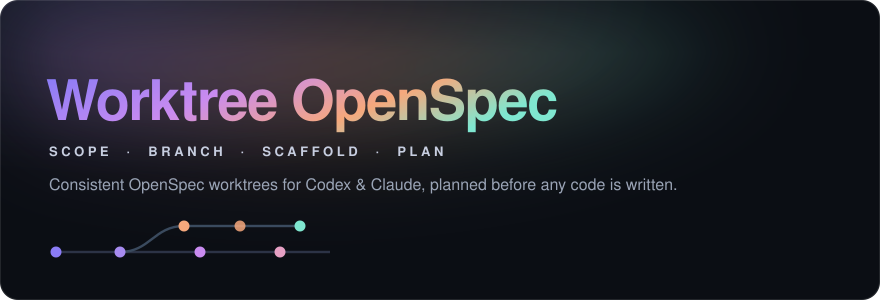
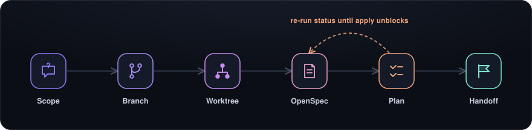

<div align="center">



[](https://github.com/mikec-git/worktree-openspec-skill)
[](https://github.com/mikec-git/worktree-openspec-skill)
[](#installation)
[](#why-it-works-this-way)
[](https://github.com/mikec-git/worktree-openspec-skill/commits/main)

**Every task starts in the same shape: a scoped brief, an isolated worktree, and an OpenSpec plan, before any code is written.**

</div>

A shared Codex and Claude skill that turns "start a new task" into a repeatable setup: it captures concrete scope, branches off a freshly synced base, creates a sibling git worktree, scaffolds an OpenSpec change inside it, and holds the worktree as _not ready_ until the OpenSpec plan is complete and validated.

This repository is the single source of truth for both agents. Runtime skill paths should symlink back to `skills/worktree-openspec-workflow` instead of keeping separate copies.

## How It Works

<div align="center">



</div>

- **Scope** — Generate a discovery flow from the requested feature and ask one `Yes` / `No` / `Chat` question at a time until the scope is concrete enough to write a meaningful proposal. Nothing is created until scope is captured.
- **Branch** — Cut an agent-owned task branch: `codex/<task>` or `claude/<task>`. The base is fetched first and fast-forwarded only when it is safe to do so.
- **Worktree** — Create a sibling worktree (e.g. `../ccmux-<task>`) so the task is isolated from the base checkout and never disturbs uncommitted work.
- **OpenSpec** — Run `openspec init --tools <agent>` in the worktree, create the change, and initialize `proposal.md` from the current OpenSpec template.
- **Plan** — Fill in the proposal, then work through `design.md`, `specs/<capability>/spec.md`, and `tasks.md` in the order OpenSpec reports. Re-run `openspec status` after each artifact and `openspec validate --strict` at the end.
- **Handoff** — Present scope, branch, worktree path, base commit, OpenSpec status, and verification commands. Only hand off once `openspec instructions apply` is no longer `blocked`.

## Why It Works This Way

- **Consistency over recall.** Every worktree lands in the same place, with the same branch convention and the same planning artifacts, so any later session (human or agent) can orient instantly.
- **Plan before code.** OpenSpec apply stays `blocked` until `tasks.md` exists, so implementation cannot start on a half-formed spec. A worktree is mechanically created early but is deliberately _not_ "ready" until the plan validates.
- **Safe by default.** The setup script fetches `origin`, refuses to overwrite an existing branch / worktree / change, and never cleans or resets your base checkout. Scope capture happens entirely in chat first.
- **One skill, two agents.** Codex and Claude run the identical workflow; only the branch prefix and the structured-input tool differ.

## Installation

Clone the repository somewhere durable, then install the shared skill into both Codex and Claude:

```bash
git clone https://github.com/mikec-git/worktree-openspec-skill.git
cd worktree-openspec-skill
./install.sh
```

`install.sh` symlinks `skills/worktree-openspec-workflow` into `$CODEX_HOME/skills` (default `~/.codex/skills`) and `~/.claude/skills`. After restarting or refreshing the agent, the skill appears as `worktree-openspec-workflow`.

**Dependencies:** `git`, `openspec`, and `jq` are required. The base repository must have an `origin` remote. `gh` is optional, only for publishing this repository through the GitHub CLI.

## Usage

Ask for the skill by name in Codex or Claude:

```text
Use $worktree-openspec-workflow to set up a task worktree for <task>.
```

The skill clarifies scope first. Once scope is concrete, it runs the bundled setup script for the mechanical steps:

```bash
skills/worktree-openspec-workflow/scripts/setup_ccmux_worktree.sh \
  --task my-task \
  --agent codex            # or: claude
```

To target a different project, override the defaults:

```bash
skills/worktree-openspec-workflow/scripts/setup_ccmux_worktree.sh \
  --task my-task \
  --agent claude \
  --repo /path/to/project \
  --worktrees-root /path/to/worktrees
```

> **Note:** The bundled script defaults to the author's ccmux layout — base repo `/Users/mchoi/repos/ccmux`, worktree root `/Users/mchoi/repos`, worktree name `ccmux-<task>`. Use `--repo` and `--worktrees-root` for any other project.

<details>
<summary><strong>Script options, safety behavior &amp; repository layout</strong></summary>

### Script Options

```text
--task <slug>                  Required kebab-case task slug.
--agent codex|claude           Agent owner. Defaults to codex.
--repo <path>                  Base git repository. Defaults to /Users/mchoi/repos/ccmux.
--worktrees-root <path>        Parent directory for new worktrees. Defaults to /Users/mchoi/repos.
--change <name>                OpenSpec change name. Defaults to the task slug.
--skip-openspec                Create only the worktree and branch.
--skip-openspec-artifacts      Create the OpenSpec change without initializing proposal.md.
```

### Safety Behavior

The setup script is intentionally conservative:

- Refuses to overwrite an existing worktree path, branch, or OpenSpec change.
- Fetches `origin` before creating the worktree.
- Fast-forwards `main` only when the base checkout is on `main` with no tracked local changes; otherwise uses `origin/main` as the base.
- Refuses to continue when `openspec` or `jq` is missing for artifact initialization.
- Initializes only `proposal.md`; the active agent completes the remaining artifacts from OpenSpec instructions before implementation starts.

### Repository Layout

```text
install.sh                         Symlink installer for Codex and Claude.
assets/                            README artwork (hero, flow diagram).
skills/worktree-openspec-workflow/
  SKILL.md                         Main shared skill instructions.
  agents/openai.yaml               Skill metadata for OpenAI / Codex surfaces.
  references/openspec-artifacts.md OpenSpec artifact sequence reference.
  references/scope-brief.md        Scope capture and discovery prompt rubric.
  scripts/setup_ccmux_worktree.sh  Worktree and OpenSpec scaffold script.
```

</details>

## Current Limitations

- The bundled script name and default worktree naming are ccmux-specific; other projects must pass `--repo` and `--worktrees-root`.
- The workflow supports `codex` and `claude` agent owners only.
- The script initializes only `proposal.md`; remaining OpenSpec artifacts must be completed from OpenSpec instructions before implementation starts.
